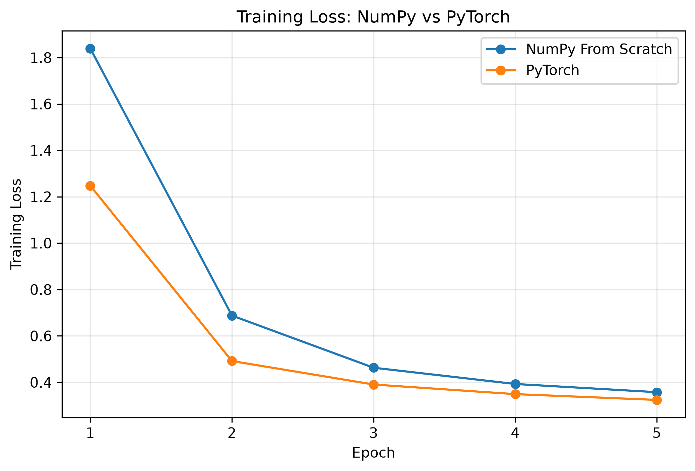
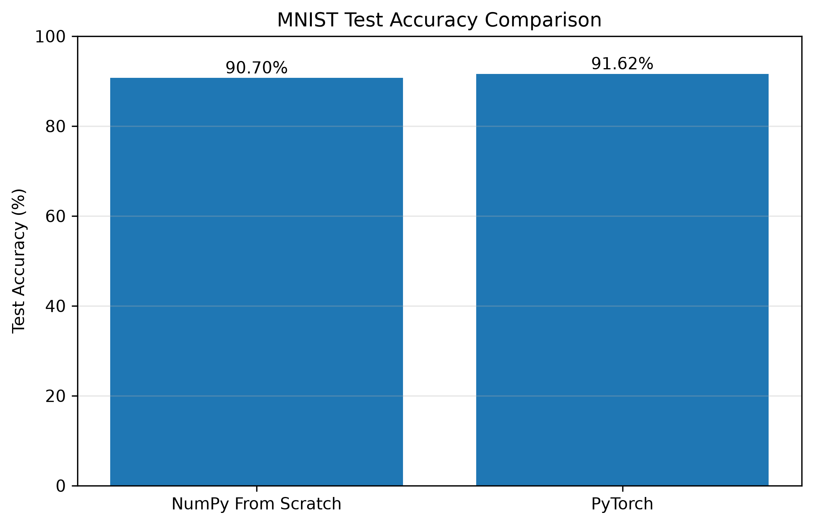
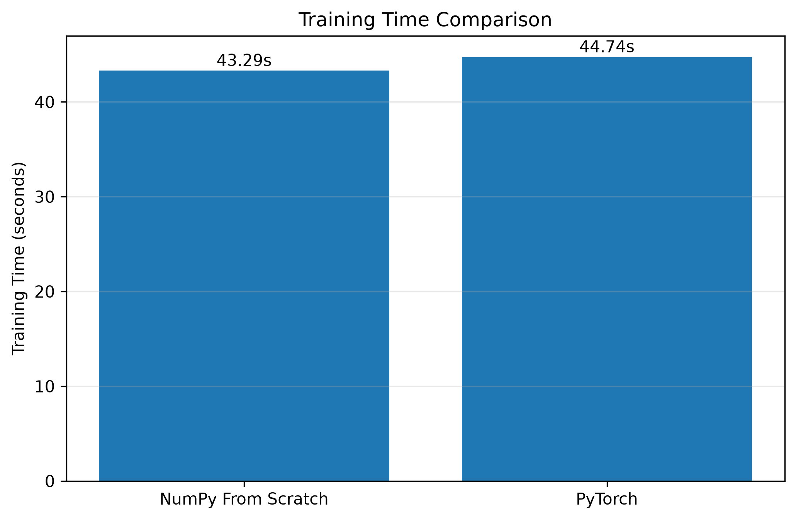
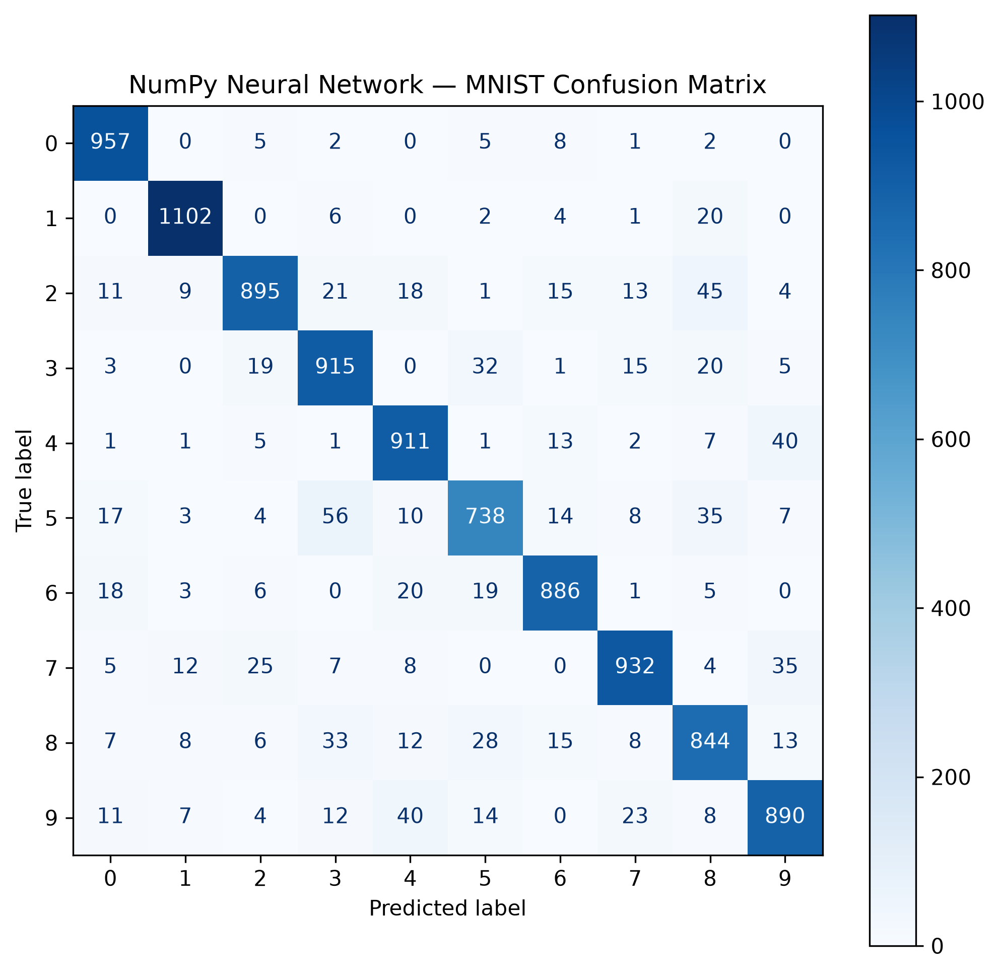
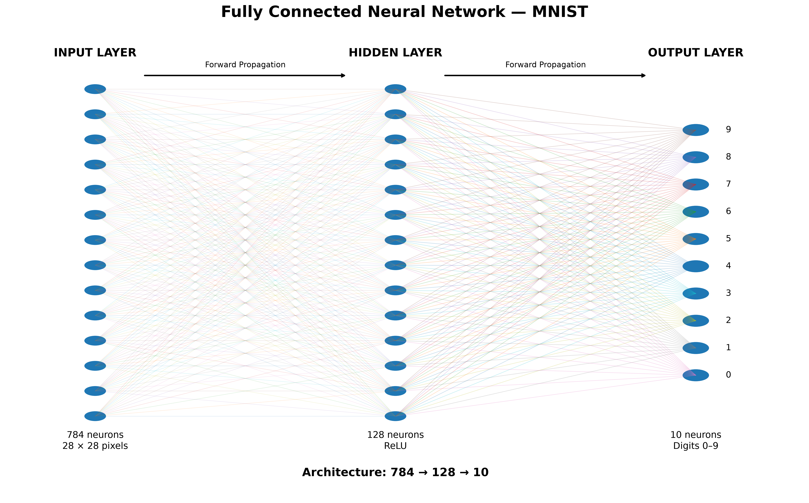

# MNIST Neural Network From Scratch with NumPy

A handwritten digit classification project built to understand the core
mechanics of neural networks by implementing a fully connected neural network
from scratch using NumPy, and then comparing it with an equivalent PyTorch
implementation.

## Project Overview

The project uses the MNIST handwritten digit dataset containing 70,000
grayscale images of handwritten digits from 0 to 9.

Each image is:

- 28 × 28 pixels
- Converted into 784 input features
- Normalized to the range 0–1

The neural network architecture used in both implementations is:

**784 → 128 → 10**

The model contains:

- One fully connected hidden layer
- ReLU activation
- Output layer with 10 classes
- Softmax probabilities for the NumPy implementation
- Cross-entropy loss
- Mini-batch gradient descent

## Why Build It From Scratch?

Instead of directly using a deep-learning framework, the NumPy version
manually implements the main operations involved in neural network training.

This includes:

- Forward propagation
- ReLU activation
- Softmax
- Cross-entropy loss
- Backpropagation
- Gradient calculation
- Gradient descent
- Parameter updates
- Prediction
- Accuracy evaluation

The purpose was to understand what happens inside a neural network before
using high-level frameworks such as PyTorch.

## PyTorch Comparison

After implementing the network with NumPy, the same architecture and
training configuration were implemented using PyTorch.

The PyTorch version uses:

- `nn.Linear`
- `nn.ReLU`
- `CrossEntropyLoss`
- SGD optimizer
- Automatic differentiation

Both models were trained using:

| Parameter | Value |
|---|---:|
| Architecture | 784 → 128 → 10 |
| Epochs | 5 |
| Batch Size | 64 |
| Learning Rate | 0.01 |
| Optimizer | SGD |

## Results

| Implementation | Test Accuracy | Training Time |
|---|---:|---:|
| NumPy From Scratch | **90.70%** | **43.29s** |
| PyTorch | **91.62%** | **44.74s** |

The results represent a single training run on the development machine.

### Training Loss

The training loss decreases across the five epochs for both implementations,
showing that the models are learning from the training data.

### Test Accuracy

The NumPy implementation achieved **90.70%** test accuracy, while the PyTorch
implementation achieved **91.62%** on the same MNIST test set.

### Training Time

The measured training times were **43.29 seconds for NumPy** and
**44.74 seconds for PyTorch** in this run.

Training time is dependent on the hardware and execution environment.

### Confusion Matrix

The confusion matrix shows the classification performance of the NumPy
neural network across all ten digit classes and highlights which digits are
most frequently confused with one another.

## Neural Network Architecture

The model is a fully connected neural network with 784 input features,
128 hidden neurons, and 10 output classes.

## Custom Digit Testing

The trained models were also tested using custom MNIST-style handwritten
digit images.

The inference process converts an input image into the same format used
during training:

**Image → Grayscale → 28 × 28 → Normalize → 784 Features → Prediction**

Both the NumPy and PyTorch models can classify these custom digit images.

## Key Takeaways

This project provided hands-on experience with the fundamental mechanics of
neural networks, including forward propagation, backpropagation, gradients,
loss functions, and gradient descent.

Implementing the model with NumPy first made it possible to understand the
operations that PyTorch later abstracts through automatic differentiation and
high-level neural network components.
